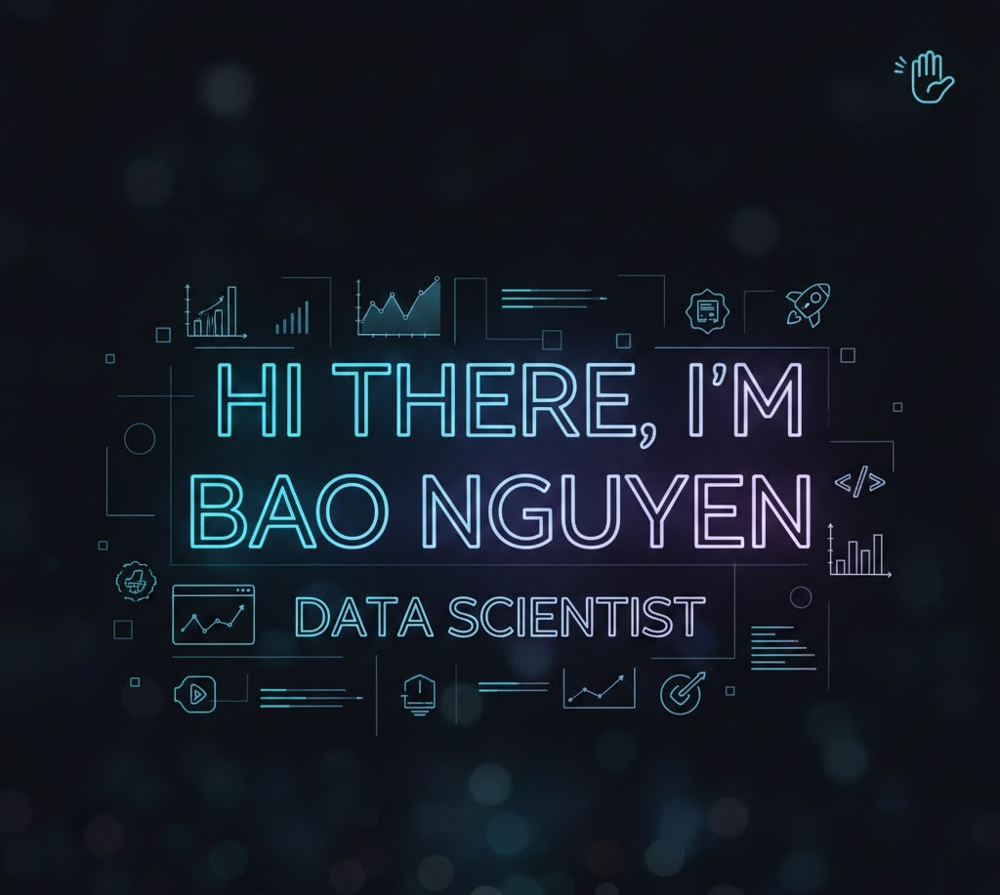

  

### 🚀 Data Scientist | AI Researcher | Data Engineer

I am a passionate **Data Scientist** dedicated to turning complex data into actionable insights and building intelligent systems. With a strong foundation in statistical analysis and machine learning, I enjoy solving real-world problems through data-driven approaches.

---

### 🛠 Skills & Expertise

* **Core Expertise:** Machine Learning, Time Series Analysis, Statistical Modeling, Natural Language Processing (NLP).
* **Languages:**   
* **Frameworks & Libraries:**  `Pandas`, `NumPy`, `Scipy`, `Statsmodels`, `Scikit-learn`, `PyTorch`, `TensorFlow`.
* **Data Visualization:**  `Matplotlib`, `Seaborn`, `Power BI`, `Tableau`.
* **Software & Cloud:**
    * **Tools:** Jupyter Notebook, Google Colab, VS Code, Excel.
    * **Cloud/DB:** MySQL, BigQuery, Google Cloud, AWS.
- **Frameworks & Libraries:**
  - **Data Manipulation:** `Pandas`, `NumPy`
  - **Visualization:** `Matplotlib`, `Seaborn`
  - **Machine Learning:** `Scikit-learn`
  - **Deep Learning:** `PyTorch`, `TensorFlow`

---

### 📫 Let's Connect!

I'm always open to collaborating on interesting projects or discussing about opportunities in Data Science. Feel free to reach out!

* **LinkedIn:** [Gia Bao Nguyen](https://www.linkedin.com/in/nguyengiabao005/)
* **Email:** [mrngb2000@gmail.com](mailto:mrngb2000@gmail.com)

---

*“Data is the new oil, but intelligence is the new engine.”*
