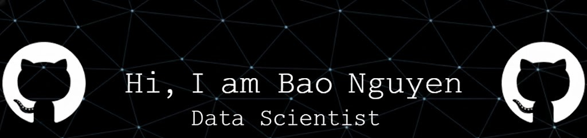
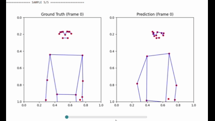
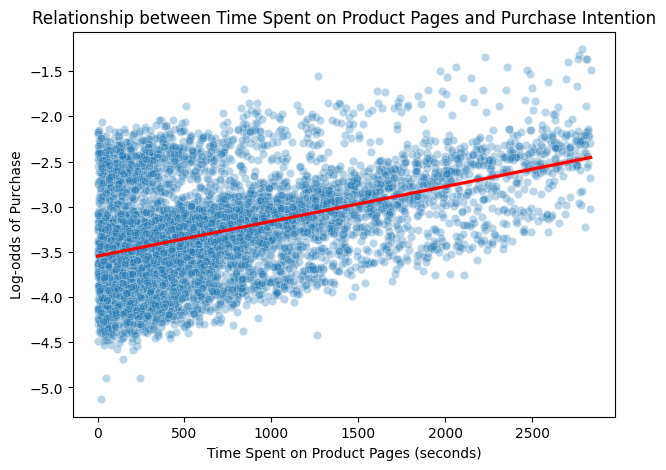
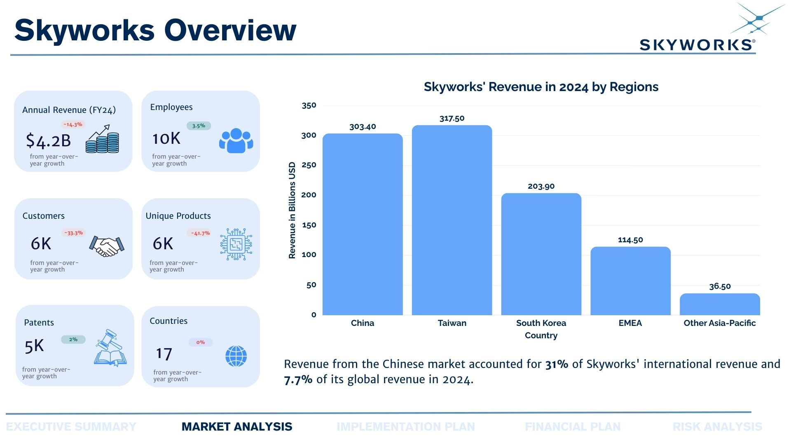

  

### 🚀 DATA SCIENTIST | AI RESEARCHER | STATISTICIAN

Oops, what are you doing here? Anyway, welcome to my portfolio.
Here you’ll find a collection of projects I’ve worked on, some challenging,
some frustrating, but all meaningful.  
Yes, a few of them were completed while I was staring at my screen at 3 a.m 😀.

**About Me:** I am Bao Nguyen, a graduate student in Data Science and Analytics with over one year of experience in machine learning and data mining. My skill set spans Data Science, Statistical Modeling, and AI Engineering, with a strong focus on Natural Language Processing (NLP) and Business Intelligence (BI).

---

### 🛠 SKILLS & EXPERTISE

* **Core Expertise:** Machine Learning, Statistical Modeling, Natural Language Processing (NLP), Machine Learning Operations (MLOps).
* **Languages:**   
* **Software & Cloud:**
    * **Tools:** Jupyter Notebook, Google Colab, VS Code, Excel, Power BI, Tableau, Docker.
    * **Cloud/DB:** MySQL, BigQuery, Google Cloud, AWS.
* **Frameworks & Libraries:**
  - **Data Manipulation:** `Pandas`, `NumPy`
  - **Visualization:** `Matplotlib`, `Seaborn`
  - **Machine Learning:** `Scikit-learn`
  - **Deep Learning:** `PyTorch`, `TensorFlow`
  - **Statistics:** `SciPy`, `Statsmodels`
---

### 🔬 PROJECT HIGHLIGHTS

<strong>| END-TO-END MACHINE LEARNING APPLICATION FOR CREDIT FRAUD DETECTION |
</strong>

  

**Description:**
The goal of this project is to simulate a real-world credit banking system. It covers the full machine learning lifecycle, including feature engineering, algorithm selection, oversampling for class imbalance, precision–recall trade-off analysis, and model deployment. An XGBoost model was trained and deployed as a RESTful service using a Flask API, then containerized with Docker for scalability. To handle data drift, the system starts computing the Population Stability Index (PSI) each time the data volume increases by 20%. If the PSI exceeds 0.3, it automatically triggers model retraining.

**View the full project here:** [An MLops Pipeline for Real-time Credit Fraud Detection](https://github.com/BaoNguyen151654/MLOPS_FRAUD_DETECTION)

<strong>| RESEARCH IMPLEMENTATION: SPATIOTEMPORAL TRANSFORMERS FOR SIGN LANGUAGE PRODUCTION |
</strong>

  

**Description:**
This project aims to overcome language barriers for the Deaf community. 
I built a Spatiotemporal Transformer model from scratch that translates text into sign language. 
The model was trained and tested on the PHOENIX-14 dataset, a well-known dataset for German Sign Language. 
Temporal and spatial attention in the decoder enables the model to capture both dimensions effectively, 
achieving a normalized DTW score of 0.49, which is a 91.4% improvement over traditional Transformer models on the same dataset.

**View the full project here:** [Spatiotemporal Transformers for Sign Language Production](https://github.com/BaoNguyen151654/Spatiotemporal-Transformers-for-Sign-Language-Production)

<strong>| REGRESSION ANALYSIS: ANALYZING FACTORS ASSOCIATED WITH ONLINE CUSTOMER PURCHASE INTENTION |
</strong>

  

**Description:**
This project investigates which factors are most associated with online customer purchase intention by interpreting a logistic regression model. The results reveal an interesting insight: returning visitors are less likely to make a purchase. The Average Marginal Effect (AME) indicates that the probability of making a purchase is 3.56% lower for returning visitors.

**View the full project here:** [Analyzing factors associated with online customer purchase intention](https://github.com/BaoNguyen151654/Analyzing-Factors-Associated-with-Online-Customer-Purchase-Intention/tree/main)

<strong>| DATA ENGINEERING: END TO END DATA PIPELINE OF AN ONLINE BIKE SHOP |
</strong>

  

**Description:**
In this project, I built an end-to-end data-driven system for a bike shop, including a relational database and data pipelines managing 321 products and over 1,400 customers. The database is integrated with a Flask-based shopping platform to process real-time transactions and automatically update inventory. Additionally, I wrote SQL queries to extract and prepare datasets for machine learning tasks. The resulting machine learning model achieves an overall accuracy of 83% in predicting the product segment a customer is likely to purchase, helping the shop owner optimize inventory and provide more effective customer recommendations.

**View the full project here:** [Database of an online bike shop and machine learning](https://github.com/BaoNguyen151654/Database_ML_Bikeshop_Project)

<strong>| BUSINESS INTELLIGENT: FORECASTING SKYWORKS NET INCOME AND BUSINESS RECOMMENDATIONS |
</strong>

  

**Description:**
In this project, I lead a team of three to develop a 5-year strategic plan for [**Skyworks Solutions**](https://www.skyworksinc.com/), a U.S. semiconductor company. Our proposal focuses on shifting manufacturing to Germany and expanding into the AI chip market. We analyze Skyworks’ net income under two scenarios: **Maintaining the current business model (Scenario 1 )** versus **Implementing our strategy (Scenario 2)**. We develop a Prophet model to forecast Skyworks’ revenue in Scenario 1 and calculate Skyworks’ revenue in Scenario 2 using financial methods and assumptions based on their past performance. The results show that Skyworks can achieve break-even in Germany within 5 years, generating an estimated total income of $418M if they follow our strategy.

**View the full project here:** [Skyworks Analytics](https://github.com/BaoNguyen151654/Forecasting-Skyworks-Financial-Performance-and-Strategic-Business-Recommendations)

---

### 📫 **LET'S CONNECT!**

I'm always open to collaborating on interesting projects or discussing about opportunities in Data Science. Feel free to reach out!

* **LinkedIn:** [Gia Bao Nguyen](https://www.linkedin.com/in/nguyengiabao005/)
* **Email:** [mrngb2000@gmail.com](mailto:mrngb2000@gmail.com)

---
